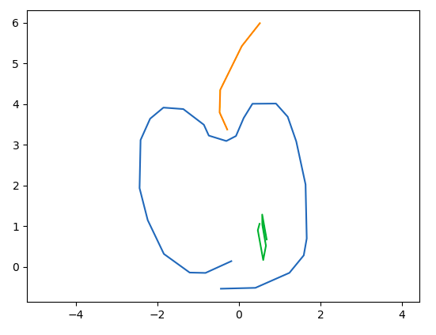

# SketchRNN-Pytorch

SketchRNN is a seq2seq VAE model which draws pictures.  
Paper: https://arxiv.org/abs/1704.03477

## Getting Started

### Prerequisites

- Anaconda
- Pytorch
- TensorBoard

## Run the test

modify proper pathes to load and save data, model and logs before runnning the experiment script below.

```
python test.py
```

Losses and predictions will be shown in TensorBoard.



## Details

- model.py : Model Definition
- trainer.py : Define how to train the model
- dataset.py : Dataset Definition
- utils.py : utilites
- test.py : a test experiment with smaller model
- exp1.py : an experiment with original model

## References

- [A Neural Representation of Sketch Drawings](https://arxiv.org/abs/1704.03477)
- [Sketch-RNN: A Generative Model for Vector Drawings](https://github.com/tensorflow/magenta/tree/master/magenta/models/sketch_rnn)
- [Pytorch-Sketch-RNN](https://github.com/alexis-jacq/Pytorch-Sketch-RNN)